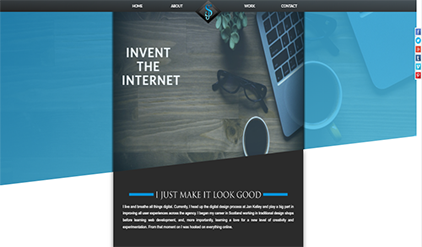
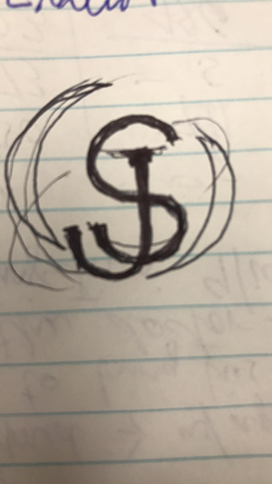
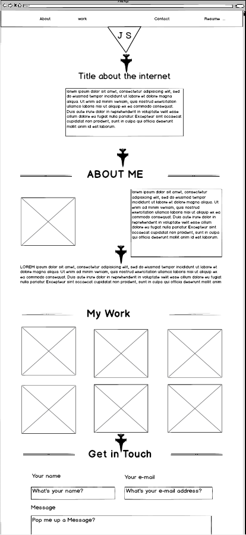
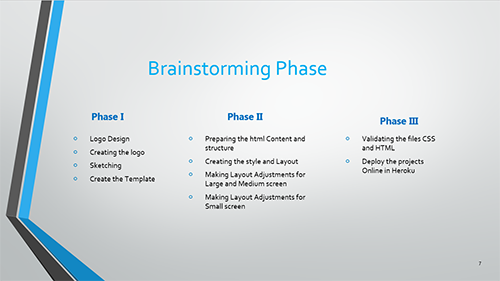

# Portfolio
Student Portfolio Website Project 2018
## Link to portfolio
<a href="https://portfolio02.herokuapp.com" target="_blank">https://portfolio02.herokuapp.com</a> 

## Link to GitHub repo
https://github.com/jaouadpxy/portfolio2

## Description
A portfolio website is a greatway to demonstrate personal abilities and skillset to gain more business and build professional brand. This website has been designed, built and deployed to showcase these skillset and coding experience.
### Purpose
The main objectives for the portfolio include:
* showcasing personal skillset
* showcasing completed projects & achievements
* gaining valuable experience by design & building website 
* meeting the college's certification requirement

### Functionality / features
Key features of this portfolio include the following at minimum:
* Name and contact details.
* Personal Bio demonstrating personality & 
* Professional skillset
* Education & Work history
* Links to Github, twitter, Google+, LinkedIn, Youtube

In future, these features will be made dynamic to ensure maintainability & scalability. This is expected to happen next semester after learning Ruby on rails and Node & Reacts/Redux. 
### Sitemap
https://github.com/jaouadpxy/portfolio2/blob/master/sitemap.xml
```xml
<?xml version="1.0" encoding="UTF-8"?>
    <urlset
          xmlns="http://www.sitemaps.org/schemas/sitemap/0.9"
          xmlns:xsi="http://www.w3.org/2001/XMLSchema-instance"
          xsi:schemaLocation="http://www.sitemaps.org/schemas/sitemap/0.9
                http://www.sitemaps.org/schemas/sitemap/0.9/sitemap.xsd">
    <!-- created with Free Online Sitemap Generator www.xml-sitemaps.com -->
    <url>
        <loc>https://portfolio02.herokuapp.com/</loc>
        <lastmod>2018-09-24T04:18:41+00:00</lastmod>
        <changefreq>always</changefreq>
    </url>
</urlset>
```
### Screenshots

### Target audience
The main target audience are:
* Potential Employers
* Lecturers
* Students
* All other Stakeholders 

### Tech stack (e.g. html, css, deployment platform, etc)
A range of Tech stack were used to develop a static application. This includes:
* HTML for the portfolio Layout
* CSS for styling the App
* JavaScript to add desired behaviors to the Pages.
* Git for version control & code repository
* XML Sitemap Generator
## Design documentation
The design has been thoroughly documented from the initiation to final phase. All the relevant documents have been included in the final submission. Key technology tools such as Trello were used to aid with project management & planning.
### Design process
A thorough design process was selected to ensure a successful completion of the portfolio website. The following are the setps: 
1. Define the Portfolio Website
2. Scope the website
3. Prepare Visual Design using wireframe & moodboard
4. Undertake the site development
5. Undertake the site testing  and launch
6. Future considerations including Site maintenance & scalability
### Wireframes
The site wireframes were hand sketched and later converted to design moodboards in photoshop. 




### Personal logo (optional)

### Usability considerations
Usability or user experience was one of the key considerations throughout the design and implementation stages of this portfolio website. A simple but easy to use sleek portfolio layout was selected and implemented to ensure that site visitors can accurately and quickly complete their top tasks while navigating the site.
## Details of planning process
A deeper understanding of key project requirements was undertaken by carefully going through the Portfolio guideline document to gauge the the project scope, and identified the targeted audience. A clear project scope of work was then developed followed by brainstorming and researching to select the desired page layout, and other relevant visual design effect.  Utilizing the project scope, the Design was then broken down into small deliverable tasks and cards with clear deadlines, and the trello web Application was used to aid with planning process. A Project was then created on the development PC as well as on Github including the associated  folders and Repos before moving on the project implementation stage. Project wireframes were hand sketched, and photoshop was used to prepare the project Logo and moodboard.
### Project plan & timeline



## Short Answer Q&A - Include short answers to the following questions,
1. Describe key events in the development of the internet from the 1980s to today (max. 150 words)
>The internet has come along way since its inception in the 1970s. The period between 1980s to today has lead to key events  in the development of the internet including the development of TCP/IP, the invention of World Wide Web, the launching of the first website by CERB, the introduction of first dial-up service by Pipex, the launching of Britain's first internet news Website- tegraph.co.uk, the introduction of first peer-to-peer(P2P) Music file-sharing site by Napste, the launching of BBC TV and radio catch-up service iPlayer, and most importantly, the launching of first iPhone delivering the internet in your pocket.


2.  Define and describes the relationship between fundamental aspects of the internet such as: domains, web servers, DNS, and web browsers (max. 150 words)
>Domains refers to names of the website. Sometimes, they are  referred to as Uniform Resource Locator (URL) or host names because names are easy to remember than IP Addresses. Web servers are Computers that are usually set up in facilities called data centers and operated by hosting companies to store websites that people can visit on the internet. Web Servers communicate with many browsers on many computers at all time to serve files, as requested. Domains Name System converts or translates domain names into IP Addresses. This allows access to an internet location by its domain name. The Web Browsers i.e. firefox, Safari, Chrome, Internet Explorer, are responsible for reading the files stored on web servers and convert them into images and text to view. Web Browsers communicate with web servers to bring information from the internet.


3.  Reflect on one aspect of the development of internet technologies and how it has contributed to the world today (max. 150 words)
>Since inception, internet has exponentially revolutionized the computer & communications fields. Its success has lead to an enhanced broadcasting capability, information dissemination, collaboration and interaction between individuals and their computers.  A key contributing aspect of the development of internet technologies is the invention of digital online learning platforms such as Youtube, Lynda.com, Udemy, and many more. People across the globe are able to share their knowledge and ideas with others and be able to monetize their contents. Even better, those in the remotest parts of the world, who have internet access, are also able to access free online learning resources and exposure to global markets for their produce.

